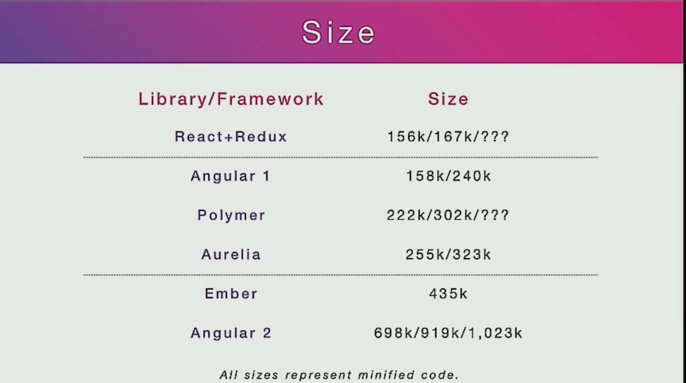

- title : Aurelia
- description : Introduction to Aurelia
- author : Bastian Töpfer
- theme : night
- transition : default

***

### What is Aurelia?

***

### Aurelia is/has
- a medium size framework with no external dependencies.
- as fast or faster than all other frameworks.
- more standards compliant than most other frameworks.
- he most unobstrusive framework today.
- integrates very well with other libraries. Other frameworks like Angular and React have a harder time with this.
- has the best support for separated presentation patterns (MVC, MVVM, MVP)
- is better at dynamic, data-driven UI construction than anything else today.
- is written in 100% ES 2015/2016, no dependencies except polyfills.
- no unnecessary DOM abstractions. faster and consume less memory
- some of the best support for Web Components.
- the only framework built with a modern, modular architecture.

***

### Other Choices

- Angular 1
- Angular 2
- Ember
- Polymer
- React

***

### How do they compare?

#### Size

---

#### Performance

---

#### Standard Compliance

---

#### Obtrusiveness

---

#### Interoperability

---

#### Separated Presentation

---

#### Project

---

#### Community

---

#### Core Team

---

#### Learning Materials

---

#### Business

---

#### What to choose?

***

### Tutorial

***

### The Reality of a Developer's Life 

**When I show my boss that I've fixed a bug:**
  

  
**When your regular expression returns what you expect:**
  

  
*from [The Reality of a Developer's Life - in GIFs, Of Course](http://server.dzone.com/articles/reality-developers-life-gifs)*

